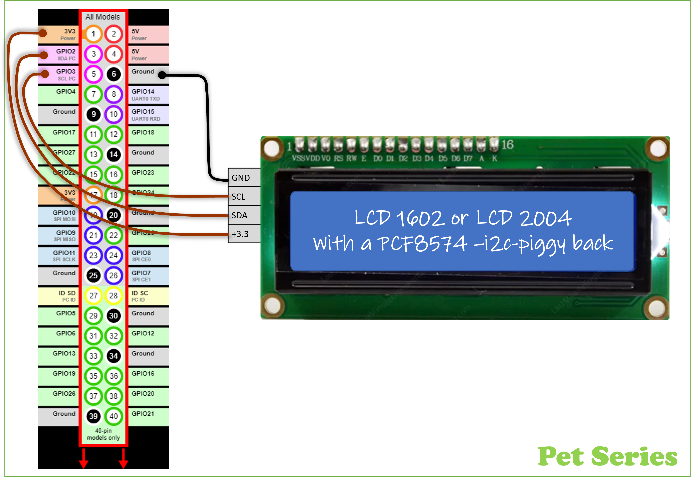

# ROS2 Python LCD-controller
ROS2 node that publish text on a LCD display. 
Supported displays LCD1604 + LCD2004 displays

**Input:** 3x topics <code>lcd_display/row1</code>...<code>lcd_display/row1</code><br>
**Output:** i2c connected display using PC8574A-interface to LCD1602 (16chr * 2 rows) or LCD2004 (20char * 4rows)
<table>
  <tr>
    <td>
      
    </td>
    <td>
      .
    </td>
  </tr>
</table>

## Prerequisite: I2C-interface Raspberry Pi 4 / Ubuntu
Prepared by adding additional, i2c communication, Linux-software-packages 
`Ubuntu Shell`
```
~$ sudo apt install i2c-tools
~$ sudo apt install python3-pip
~$ sudo pip3 install smbus2
~$ sudo pip3 install adafruit-ads1x15
~$ sudo i2cdetect -y 1
        0  1  2  3  4  5  6  7  8  9  a  b  c  d  e  f
   00:          -- -- -- -- -- -- -- -- -- -- -- -- -- 
   10: -- -- -- -- -- -- -- -- -- -- -- -- -- -- -- -- 
   20: -- -- -- -- -- -- -- -- -- -- -- -- -- -- -- -- 
   30: -- -- -- -- -- -- -- -- -- -- -- -- -- -- -- 3F 
   40: -- -- -- -- -- -- -- -- -- -- -- -- -- -- -- -- 
   50: -- -- -- -- -- -- -- -- -- -- -- -- -- -- -- -- 
   60: -- -- -- -- -- -- -- -- -- -- -- -- -- -- -- -- 
   70: -- -- -- -- -- -- -- --    
$ sudo chmod a+rw /dev/i2c-1
```

## Prerequisite: Hardware
* Single Board Computer(SBC): Raspberry Pi 4
* LCD-display LCD1620 or LCD2004 with a PC8574A-i2c-interface (default I2C adr.= <code>0x3F</code>)
<ul><blockquote>🌐Google tips to find/order Joystick from eBay/AliExpress/Wish/Amazon/...  <br>
1) "lcd1602 PC8574"<br>
2) "lcd2004 PC8574"
</blockquote></ul>
<table>
  <tr>
    <td>
      
    </td>
    <td>
      
    </td>
  </tr>
</table>

## Dowload and install this ROS2 packages
Create a ROS2 workspace (in my exampel '~/ws_ros2/') \
Dowload ROS2 package by using 'git clone'
<ul><blockquote>🤔There is probably better tutorials how to do this...<br>
                ...but here is how I made it.
</blockquote></ul>

`Ubuntu Shell`
```
~$ mkdir -p ~/ws_ros2/src
~$ cd ~/ws_ros2/src
~/ws_ros2/src$ git clone https://github.com/Pet-Series/ros_lcd_driver.git
~/ws_ros2/src$ cd ..
~/ws_ros2$ colcon build --symlink-install
~/ws_ros2$ source /opt/ros/galactic/setup.bash
~/ws_ros2$ source ./install/setup.bash
```

## ROS2 Launch sequence
`Ubuntu Shell`
```
$ 
```

# Test
Launch ROS2 package + node. Then manually update each row on display with the following commands.
 ```
$ ros2 run pet_ros2_lcd_pkg pet_lcd_node
$ ros2 topic pub /lcd_display/row1 std_msgs/msg/String "data: Text at row 1" -1
$ ros2 topic pub /lcd_display/row2 std_msgs/msg/String "data: Text at row 2" -1
$ ros2 topic pub /lcd_display/row3 std_msgs/msg/String "data: Text at row 3" -1
$ ros2 topic pub /lcd_display/row4 std_msgs/msg/String "data: Text at row 4" -1
 ```
