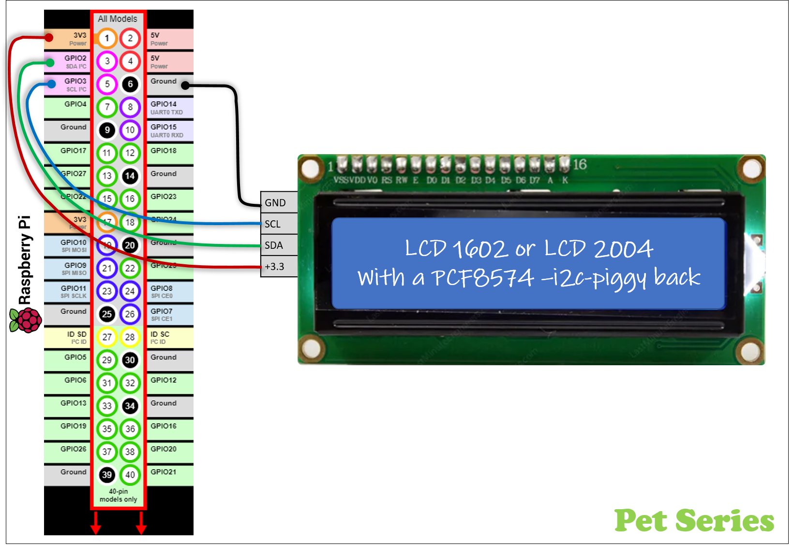
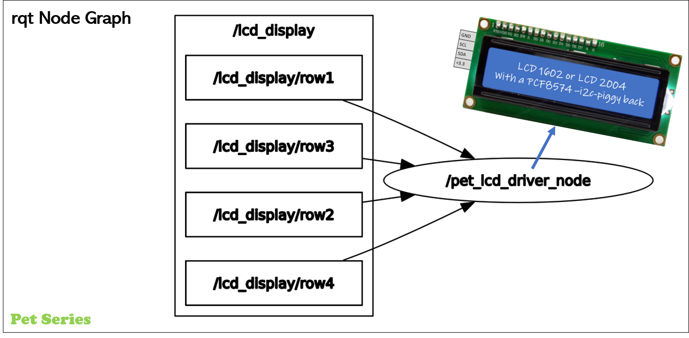
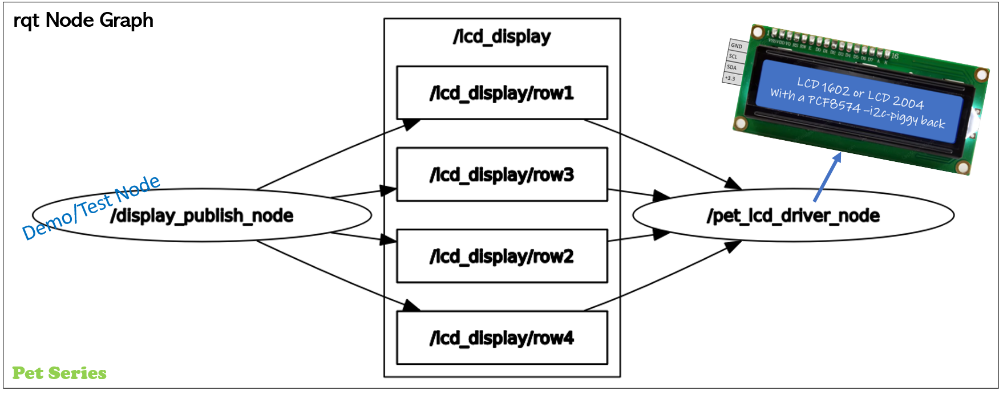

# ROS2 Python LCD-controller


## **What is this folder for?** ##

<table>
  <tr>
    <td style="vertical-align:top">
      ROS2 repository in the &copy; https://github.com/Pet-Series Git-Organizations.<br/>
      &#9642; Containing a ROS2-package.<br/>
      <br/>
      ROS2-package that publish text, via ROS2-topics, on an physical I²C-connected display.</br>
      This packages also contains a ROS2 test publisher.<br/>
      <br/>
      <h3><b>Supported LCD displays</b></h3>
        &#9642; LCD1604 (16chr x 2row) with a PC8574 'piggyback'<br />
        &#9642; LCD2004 (20chr x 4row) with a PC8574 'piggyback'<br />
      <br />
      <h3><b>ROS1 vs ROS2?</b></h3>
      For a ROS1 version - Please see https://github.com/Pet-Series/ros_lcd_driver.git
    </td>
    <td>
      
    </td>
  </tr>
</table>

## ROS2 Package/Module Overview
**Input:** 4x topics <code>lcd_display/row1</code>...<code>lcd_display/row1</code><br />
**Input:** Parameter 'lcd_i2c_address' with default address <0x3F>.
**Output:** i2c connected display using a PC8574A-interface
<table>
  <tr>
    <td>
      
    </td>
  </tr>
</table>

## ROS2 Package/Module Behaviour
1. Once: Read ROS2 Parameters for I²C-address.
1. Once: Power up initialization. Update LCD row1='initialization'
1. Repeatedly: Subscripe on topics
1. Repeatedly: Update LCD-screen


# Prerequisites
## Prerequisite: Hardware & Wiring
* Single Board Computer(SBC): Raspberry Pi 3/4
* LCD-display LCD1620 or LCD2004 with a PC8574-I²C-interface (default I2C adr.= <code>0x3F</code>)
<ul><blockquote>🌐Google tips to find/order display on eBay/AliExpress/Wish/Amazon/...  <br />
1) "lcd1602 PC8574"<br />
2) "lcd2004 PC8574"
</blockquote></ul>
<table>
  <tr>
    <td>
      
    </td>
    <td>
      
    </td>
  </tr>
</table>

## Prerequisite: Software - Raspberry Pi 3/4 Ubuntu
Prepared by adding additional, I²C communication, Linux-software-packages. That allow Python3 script to access I/O-ports.<br />
`Ubuntu Shell`
```
~$ sudo apt install i2c-tools
~$ sudo apt install python3-pip
~$ sudo pip3 install smbus2
~$ sudo pip3 install adafruit-ads1x15
~$ sudo i2cdetect -y 1
        0  1  2  3  4  5  6  7  8  9  a  b  c  d  e  f
   00:          -- -- -- -- -- -- -- -- -- -- -- -- -- 
   10: -- -- -- -- -- -- -- -- -- -- -- -- -- -- -- -- 
   20: -- -- -- -- -- -- -- -- -- -- -- -- -- -- -- -- 
   30: -- -- -- -- -- -- -- -- -- -- -- -- -- -- -- 3F 
   40: -- -- -- -- -- -- -- -- -- -- -- -- -- -- -- -- 
   50: -- -- -- -- -- -- -- -- -- -- -- -- -- -- -- -- 
   60: -- -- -- -- -- -- -- -- -- -- -- -- -- -- -- -- 
   70: -- -- -- -- -- -- -- --    
$ sudo chmod a+rw /dev/i2c-1
```

## Prerequisite: Dowload and install this ROS2 packages
Create a ROS2 workspace (in my exampel '~/ws_ros2/') \
Dowload ROS2 package by using 'git clone'
<ul><blockquote>🤔There is probably better tutorials how to do this...<br />
                ...but here is how I made it.
</blockquote></ul>

`Ubuntu Shell`
```
~$ mkdir -p ~/ws_ros2/src
~$ cd ~/ws_ros2/src
~/ws_ros2/src$ git clone https://github.com/Pet-Series/pet_ros2_lcd_pkg.git
~/ws_ros2/src$ cd ..
~/ws_ros2$ colcon build --symlink-install
~/ws_ros2$ source /opt/ros/galactic/setup.bash
~/ws_ros2$ source ./install/setup.bash
```

# HowTo guide
## ROS2 Launch sequence
`Ubuntu Shell(Terminal#1)`
```
$ ros2 run pet_ros2_lcd_pkg pet_lcd_driver_node 
  [INFO] [1646496266.966962625] [pet_lcd_driver_node]: pet_lcd_driver_node has started
  [INFO] [1646496266.969430757] [pet_lcd_driver_node]: - I2C: 0x3F 
```
<table>
  <tr>
    <td>
      
    </td>
    <td style="vertical-align:top">
      ROS2 RQT Node Graph<br/>
      
    </td>
  </tr>
</table>

## ROS2 Test1 - Via command line $ ros2 topic pub...
Manually update each row on display with the following commands.<br />
`Ubuntu Shell(Terminal#2)`
 ```
$ ros2 topic pub /lcd_display/row1 std_msgs/msg/String "data: First row 1" -1
$ ros2 topic pub /lcd_display/row2 std_msgs/msg/String "data: Text at row 2" -1
$ ros2 topic pub /lcd_display/row3 std_msgs/msg/String "data: Text at row 3" -1
$ ros2 topic pub /lcd_display/row4 std_msgs/msg/String "data: Finally row 4" -1
 ```
 <table>
  <tr>
    <td>
      
    </td>
  </tr>
</table>

## ROS2 Test2 - Via automatic ROS2-topic publisher example node.
Launch the included "LCD-spammer" :-)<br />
`Ubuntu Shell(Terminal#2)`
 ```
 $ ros2 run pet_ros2_lcd_pkg display_publish_node 
 ```
 <table>
  <tr>
    <td>
      
    </td>
    <td style="vertical-align:top">
      ROS2 RQT Node Graph<br/>
      
    </td>
  </tr>
</table>
